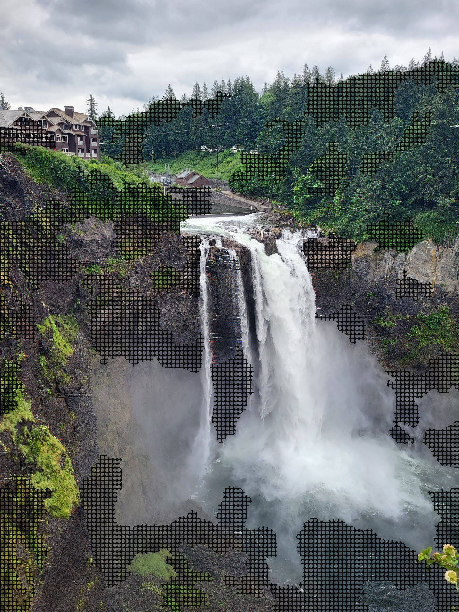
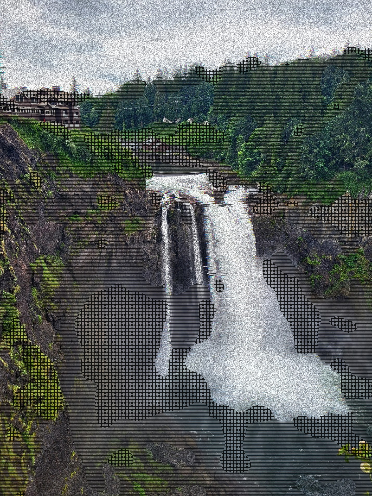
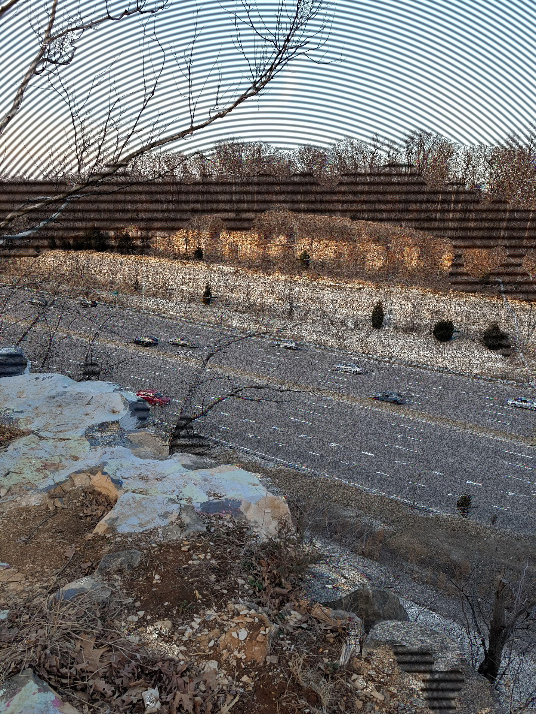

# editor

Classical computer vision design experiments on a small set of source images. Each experiment lives in its own numbered iteration folder, paired with a `prompt.md` that records the request and how the implementation addresses it.

See [CLAUDE.md](CLAUDE.md) for the full skill description, [object_separation.md](object_separation.md) for the segmentation pipeline, and [texture.md](texture.md) for the procedural texture catalogue.

## Sample outputs

### SLIC superpixel rainbow segmentation



Per-segment mean-color rendering of Snoqualmie Falls (`example1/d.jpg`) after SLIC superpixels + region merging. Each contiguous region collapses to its average color, producing a flat poster-like rendition that tracks real object boundaries rather than lighting zones.

### Texture stack permutation



One permutation from the `example1/iteration_7` texture-stack sweep: TV glitch chromatic aberration, scanlines, halftone dots, and static noise composited per zone from the segmentation labels.

### Blob-reveal compositing



Blob-reveal output from `example1/iteration_11`: each segment is revealed through a coarse blob mask (here 40x32) blended over a scanlined background, giving a partially-decoded CRT look over the highway scene (`example1/a.jpg`).

## Layout

```
editor/
  CLAUDE.md                   skill description (source of truth)
  object_separation.md        segmentation algorithm + parameters
  texture.md                  procedural texture catalogue
  example1/ example2/ example3/
    a.jpg b.jpg c.jpg d.jpg   original source images (never modified)
    iteration_N/
      prompt.md               request + approach + result
      *.py                    generated, re-runnable artifact
      *.jpg                   outputs
  LLMComputerVision/          numpy CV reference skill
```

## Rules

- Originals (`a.jpg`–`d.jpg`) are never overwritten.
- `.md` files are the source of truth; `.py` files in iteration folders are generated artifacts and can be regenerated from the skill + `prompt.md`.
- Each iteration is self-contained: `cd iteration_N && python <script>.py`.
